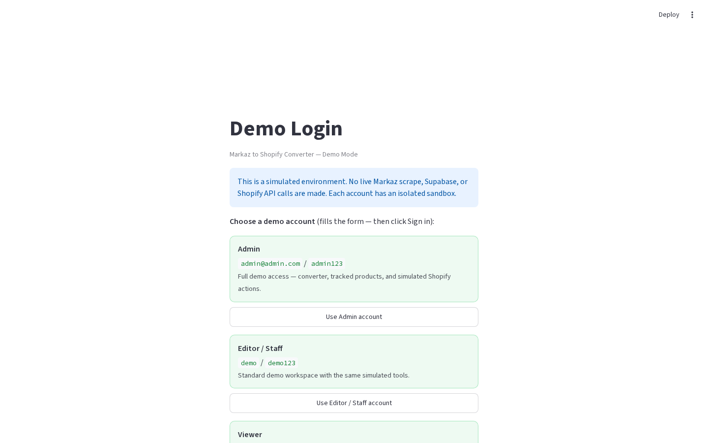

# Login

**Version:** 1.0.0  
**Route:** `/` (shown when not authenticated)  
**Who can access:** guests (unauthenticated users)

## What this page does

Protects the dashboard behind a username and password. Production uses secrets; Demo Mode shows clickable demo account cards.

## Layout at a glance

| Area | Content |
|------|---------|
| Center card | Title, caption, Demo Mode note |
| Demo only | Account cards (Admin / Editor / Viewer) + form |
| Form | Username, Password, **Sign in to Demo** |

## Steps

### Production

1. Open the app URL.
2. Enter **Username** and **Password** from `[app_login]`.
3. Click **Sign in**.
4. After success, the session is kept for **14 days** across refresh (signed `auth` query token).

### Demo Mode

1. Open Demo Mode (`streamlit run demo_mode/app.py`).
2. Click an account card to fill the form, or type credentials:
   - `admin@admin.com` / `admin123` (Admin)
   - `demo` / `demo123` (Editor / Staff)
   - `viewer@demo.com` / `view123` (Viewer; alias `viewer` also works)
3. Click **Sign in to Demo**.

## Form fields

| Label | Type | Required | Notes |
|-------|------|----------|-------|
| Username | text | yes | Trimmed on submit |
| Password | password | yes | Exact match |

## Errors & edge cases

- **Enter username and password.** — empty field(s).
- **Invalid username or password.** / **Invalid demo username or password.** — wrong credentials.
- **Login is not configured…** — production secrets missing `[app_login]`.
- Demo role labels do not change permissions; each account has an isolated sandbox with the same UI.

## Related links

- [Getting started](./00-getting-started.md)
- [Dashboard overview](./02-dashboard-overview.md)
- [Configuration setup](./14-configuration-setup.md)
- [Demo mode](./15-demo-mode.md)
