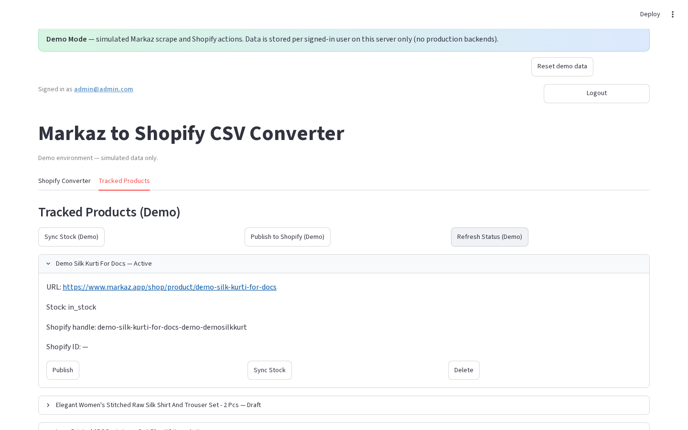

# Demo mode

**Version:** 1.0.0  
**Route:** `streamlit run demo-mode/app.py`  
**Who can access:** anyone (built-in demo accounts on the login screen)




## What this page does

Runs a self-contained demo of the Markaz → Shopify workflow with **no Supabase**, **no live Markaz scrape**, and **no real Shopify API**. Storage is per-user JSON on the server. Deploy Demo Mode separately from the production app.

## Layout at a glance

| Area | Content |
|------|---------|
| Banner | **Demo Mode** + **Reset demo data** |
| Login | Account cards · **Sign in to Demo** |
| Nav | Tabs: **Shopify Converter** · **Tracked Products** |
| Converter | Single URL · Fetch / Add · Publish All (Demo) |
| Tracked | Seeded products · Sync / Publish / Refresh (Demo) |

## Steps

1. From the repo root:

   ```bash
   streamlit run demo-mode/app.py
   ```

2. Sign in using the account cards on the login screen (credentials are shown there).

3. Try Converter fetch/add and Tracked bulk/row actions.
4. Expect demo warnings on Shopify publish/sync.
5. Optional: click **Reset demo data** to restore the seeded sandbox for the signed-in user.

## Demo vs production

| Feature | Demo | Production |
|---------|------|------------|
| Secrets | None | Required |
| Scrape | Simulated from URL | Playwright |
| Storage | `demo-mode/data/users/{username}/` | Supabase |
| Shopify | Simulated | Admin API |
| Add modes | Single URL only | Single / Multiple / Category |
| CSV download | Not in demo UI | Yes |
| Filters / pagination | No | Yes |
| Section control | Tabs | Horizontal radio |
| Deploy | Separate Streamlit entry | `app.py` / Vercel API |

First login seeds **3 professional tracked products**. Handles are prefixed with `demo-`.

## Errors & edge cases

- Role labels do not change permissions; sandboxes are isolated per username.
- Clearing `demo-mode/data/users/{username}/` resets that user’s store.
- Live demo URL is stored only in `demo-mode/demo.json` → `live_demo_url` (no passwords there).

## Related links

- [Getting started](./00-getting-started.md)
- [Login](./01-login-page.md)
- [Tracked Products tab](./09-tracked-products-tab.md)
- [Configuration setup](./14-configuration-setup.md)
