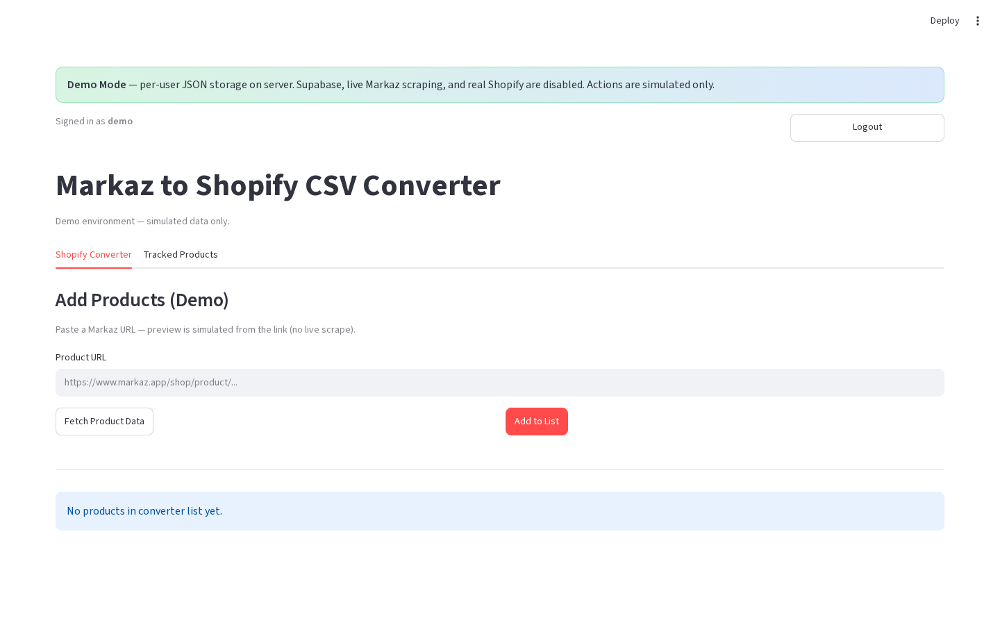

# Shopify Converter tab

**Version:** 0.1.0  
**Route:** `/` → section **Shopify Converter**  
**Who can access:** signed-in users

## What this page does

Collect Markaz products into an in-session list, adjust pricing, then download a Shopify CSV and/or publish to Shopify. Successful adds also save the Markaz URL to Tracked Products (when storage is configured).

## Layout at a glance

| Area | Content |
|------|---------|
| Add Products | Mode switch + URL input(s) + action buttons |
| Preview | Optional (Single → **Fetch Product Data**) |
| Product List | Expandable rows when the list is not empty |
| Export | Publish All + CSV download (production) |

## Steps

1. Open **Shopify Converter**.
2. Pick an add mode:
   - Production: **Single**, **Multiple**, or **Category**
   - Demo: single URL field only (**Add Products (Demo)**)
3. Paste URL(s) and add/fetch products.
4. Review the **Product List**, then export or publish.

## Mode captions (production)

| Mode | Caption |
|------|---------|
| Single | Single product mode — enter one product URL below. |
| Multiple | Multiple products mode — paste one product URL per line below. |
| Category | Category mode — paste a Markaz category/shop page URL… |

## Errors & edge cases

- Empty list shows helper text: enter a URL and click **Add to List**.
- Duplicate Markaz URLs already in the session list are skipped on bulk add.
- Demo Mode simulates scrape results; no live Playwright.

## Related links

- [Add products — Single](./04-add-products-single-mode.md)
- [Add products — Multiple](./05-add-products-multiple-mode.md)
- [Add products — Category](./16-add-products-category-mode.md)
- [Product list management](./07-product-list-management.md)
- [Export CSV & publish](./08-export-csv-and-publish.md)
