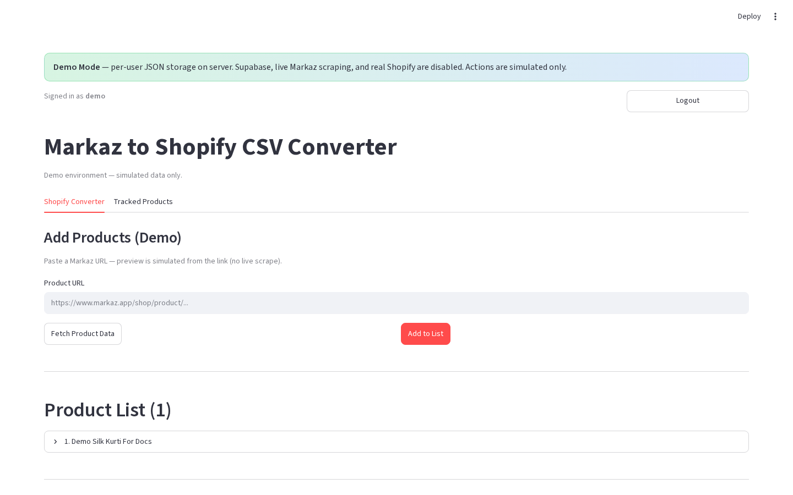

# Add products — Single mode

**Version:** 0.1.0  
**Route:** `/` → **Shopify Converter** → **Single**  
**Who can access:** signed-in users

## What this page does

Add one Markaz product URL at a time. You can fetch a preview first (and tweak pricing) or add straight to the list with default markups.

## Layout at a glance

| Area | Content |
|------|---------|
| Mode | **Single** selected (production) |
| Input | **Product URL** |
| Actions | **✅ Add to List** · **📥 Fetch Product Data** (labels may omit emoji in Demo Mode) |

## Steps

1. On **Shopify Converter**, click **Single** (production).
2. Paste a Markaz product URL into **Product URL**.
3. Choose one path:
   - **📥 Fetch Product Data** → review [preview & pricing](./06-product-preview-and-pricing.md) → **✅ Add to List** or **❌ Cancel**.
   - Or click **✅ Add to List** immediately (default [pricing rules](./13-pricing-rules.md)).
4. The product appears under **Product List**; the Markaz URL is upserted to Tracked Products when storage is available.

### Demo Mode

1. Paste URL under **Add Products (Demo)**.
2. Click **Fetch Product Data** or **Add to List**.
3. After fetch, use **Add preview to list** if you previewed first.

## Form fields

| Label | Type | Required | Validation |
|-------|------|----------|------------|
| Product URL | text | yes for actions | Should be a Markaz product link |

## Errors & edge cases

- Empty URL → action does nothing useful / shows fetch failure.
- Scrape failure (production) → error status; product not added.
- Demo always simulates success from the pasted URL slug.

## Related links

- [Product preview & pricing](./06-product-preview-and-pricing.md)
- [Add products — Multiple](./05-add-products-multiple-mode.md)
- [Shopify Converter tab](./03-shopify-converter-tab.md)
