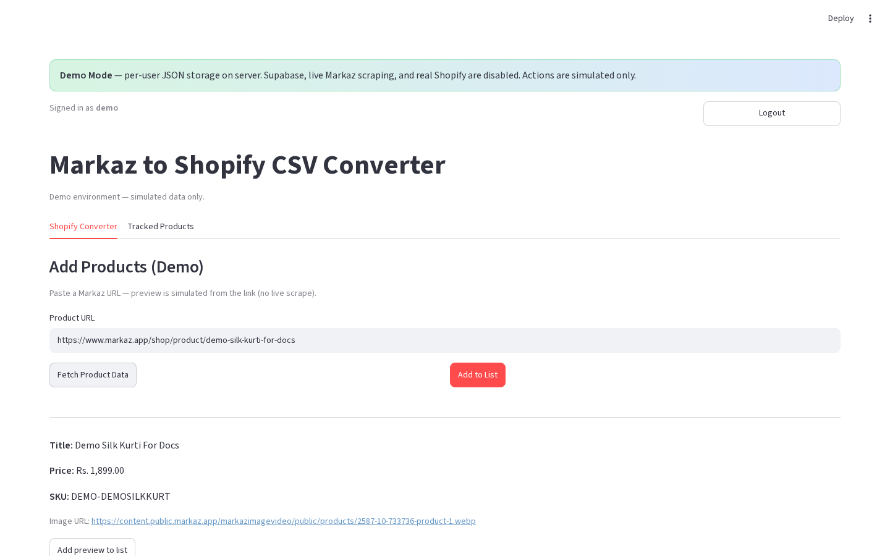

# Product preview and pricing

**Version:** 0.1.0  
**Route:** `/` → **Shopify Converter** → Single → **Fetch Product Data**  
**Who can access:** signed-in users

## What this page does

Shows scraped (or demo-simulated) product details and lets you adjust **Variant Price Adjustment** and **Compare At Price Adjustment** before adding to the list.

## Layout at a glance

| Area | Content |
|------|---------|
| Preview | Title, price, SKU, image (or image URL caption in demo) |
| Pricing | Adjustment number inputs + live final prices (production) |
| Actions | **✅ Add to List** · **❌ Cancel** (production) / **Add preview to list** (demo) |

## Steps

1. In Single mode, paste a **Product URL**.
2. Click **📥 Fetch Product Data** (or **Fetch Product Data** in demo).
3. Review title, price, and SKU.
4. (Production) Change adjustments if needed; watch **Final Variant** / **Final Compare At**.
5. Click **✅ Add to List** / **Add preview to list**, or **❌ Cancel** to discard the preview.

## Form fields (production preview)

| Label | Type | Required | Notes |
|-------|------|----------|-------|
| Variant Price Adjustment | number | no | Default from [pricing rules](./13-pricing-rules.md) |
| Compare At Price Adjustment | number | no | Default from pricing rules |

## Errors & edge cases

- Cancel clears the preview without adding.
- Demo shows: “Demo preview simulated from your pasted URL.”

## Related links

- [Pricing rules](./13-pricing-rules.md)
- [Add products — Single](./04-add-products-single-mode.md)
- [Product list management](./07-product-list-management.md)
