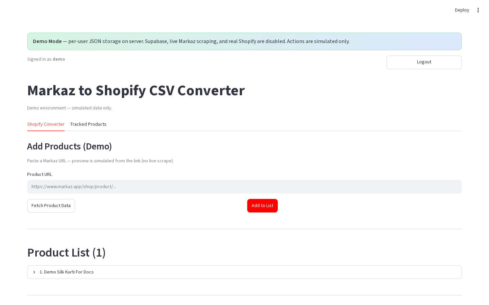

# Product list management

**Version:** 0.1.0  
**Route:** `/` → **Shopify Converter** (list section)  
**Who can access:** signed-in users

## What this page does

Shows every product queued in the current session for CSV export or Shopify publish. You can expand a row, edit prices, or remove a product.

## Layout at a glance

| Area | Content |
|------|---------|
| Header | **Product List (N products)** |
| Rows | Expanders per product |
| Row actions | **✏️ Edit Prices** · **🗑️ Remove Product N** (production) |
| Edit panel | Adjustment inputs · **💾 Save Changes** · **❌ Cancel** |

## Steps

1. Add at least one product from Single / Multiple / Category (or demo Add).
2. Open a product expander to review title, SKU, prices, URL, images.
3. (Production) Click **✏️ Edit Prices**, change adjustments, then **💾 Save Changes**.
4. Click **🗑️ Remove Product N** to drop one item from the session list.
5. Continue to [Export CSV & publish](./08-export-csv-and-publish.md).

## Expander fields (typical)

| Field | Meaning |
|-------|---------|
| Title / Base SKU | Product identity |
| Fetched Price | Original Markaz price |
| Variant / Compare At | After adjustments |
| URL | Markaz product URL |
| Images Found | Count / URLs |

## Errors & edge cases

- Empty list → helper “enter a product URL…” instead of the list header.
- Removing a product does not always delete it from Tracked Products (tracked delete is on the Tracked tab).

## Related links

- [Export CSV & publish](./08-export-csv-and-publish.md)
- [Pricing rules](./13-pricing-rules.md)
- [Shopify Converter tab](./03-shopify-converter-tab.md)
