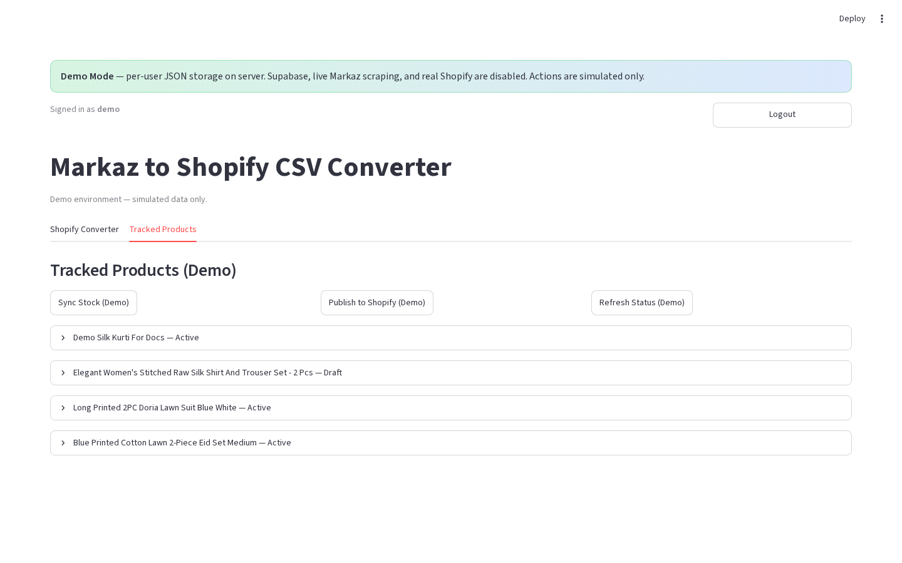
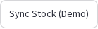
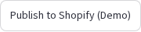
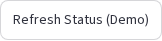
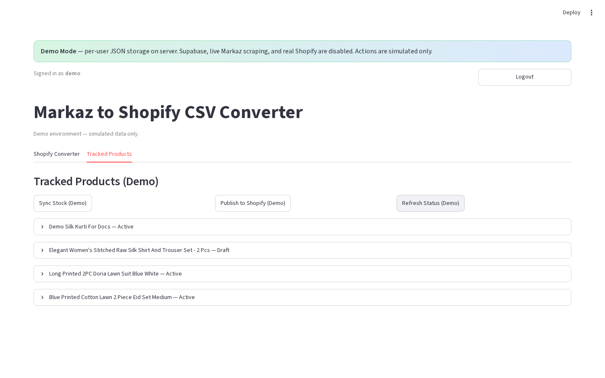

# Tracked Products — bulk actions

**Version:** 0.1.0  
**Route:** `/` → **Tracked Products** (toolbar)  
**Who can access:** signed-in users

## What this page does

Run actions on the filtered tracked set (or the full list in Demo Mode) without opening each card.

## Layout at a glance

### Production toolbar

| Button | Purpose |
|--------|---------|
| **Reload list** | Re-fetch from Supabase |
| **Remove duplicate Markaz links** | Dedupe storage |
| **Refresh All Status** | Re-scrape Markaz stock for filtered rows |
| **Refresh Shopify Status** | Live Active/Draft/Not on Shopify |
| **Send to Converter** | Load filtered rows into Converter list |
| **Sync Stock** | Push inventory/status to Shopify |
| **Publish to Shopify** | Create/update products on Shopify |
| **Delete Filtered** | Opens confirm → **Confirm Delete** / **Cancel** |

### Demo toolbar

| Button | Purpose |
|--------|---------|
| **Sync Stock (Demo)** | Simulated sync |
| **Publish to Shopify (Demo)** | Simulated publish |
| **Refresh Status (Demo)** | Simulated Markaz stock refresh |

## Steps

1. Open **Tracked Products**.
2. (Production) Set filters so the toolbar applies to the rows you want.
3. Click the bulk action you need.
4. For delete: read the warning, then **Confirm Delete** or **Cancel**.
5. Wait for success / warning banners to finish.

## Errors & edge cases

- Shopify actions warn or no-op when not configured (demo always warns that Shopify is simulated).
- **Delete Filtered** removes Supabase rows and can delete linked Shopify products in production.
- Pagination: bulk actions use the **filtered** set, not only the current page (production).

## Related links

- [Tracked Products tab](./09-tracked-products-tab.md)
- [Tracked product card](./11-tracked-product-card.md)
- [Shopify publish feedback](./12-shopify-publish-feedback.md)
