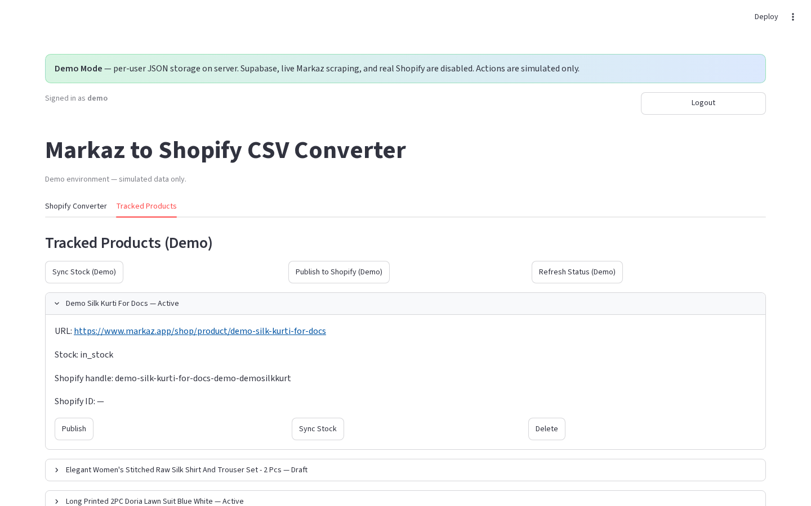
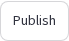
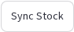

# Tracked product card

**Version:** 0.1.0  
**Route:** `/` → **Tracked Products** → row expander  
**Who can access:** signed-in users

## What this page does

Each tracked Markaz URL appears as an expandable card with status fields and row-level actions.

## Layout at a glance

| Area | Content |
|------|---------|
| Header | Title + Shopify status label (e.g. Active / Draft / Not on Shopify) |
| Body | URL, stock, Shopify handle / ID (and more fields in production) |
| Actions | Per-row buttons |

## Steps

1. On **Tracked Products**, click a row header (chevron) to expand.
2. Review Markaz URL, stock, and Shopify metadata.
3. Use a row action:
   - **Publish** / **Publish Shopify**
   - **Sync Stock**
   - **Delete**
   - Production also: **Refresh Status**, **Shopify Status**
4. Collapse the row or continue to the next product.

## Fields (demo card)

| Field | Example |
|-------|---------|
| URL | Markaz product link |
| Stock | `in_stock` / other |
| Shopify handle | `demo-…` |
| Shopify ID | ID or `—` |

## Production extras

Cards can also show Markaz stock label, Shopify status (colored), published timestamps, **Open in Shopify**, last checked / saved times.

## Errors & edge cases

- Delete removes the tracked row (and may remove Shopify product when linked in production).
- Demo publish/sync always show the demo Shopify warning banner.

## Related links

- [Tracked Products tab](./09-tracked-products-tab.md)
- [Tracked bulk actions](./10-tracked-products-bulk-actions.md)
- [Export CSV & publish](./08-export-csv-and-publish.md)
