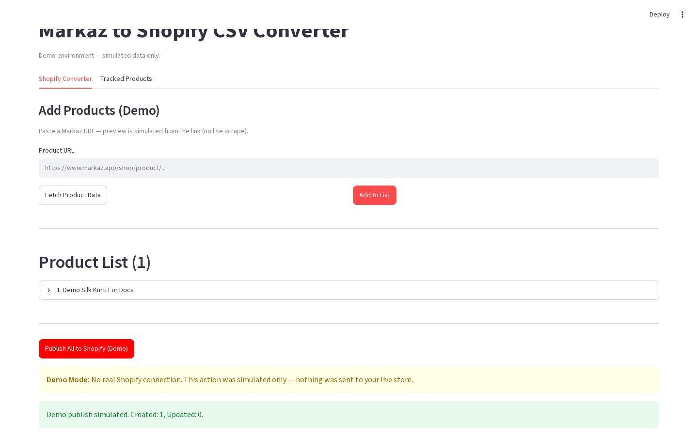

# Shopify publish feedback

**Version:** 0.1.0  
**Route:** `/` → after publish (Converter or Tracked)  
**Who can access:** signed-in users

## What this page does

After a publish (or demo publish), the app shows how many products were created or updated, plus any demo / error warnings. You can dismiss the banner and continue working.

## Layout at a glance

| Area | Content |
|------|---------|
| Success | Created / Updated counts |
| Warning | Demo Mode: no real Shopify connection |
| Action | **Dismiss publish results** (production) or continue after success message |

## Steps

1. Run **Publish All to Shopify**, **Publish to Shopify**, or a demo publish button.
2. Read the success summary (and any warning).
3. Click **Dismiss publish results** if shown.
4. Optionally open Shopify Admin (production) to verify products.

## Errors & edge cases

- Some products may fail while others succeed — check per-item messages when present.
- Demo always simulates success and shows the demo Shopify alert.
- Dismissing clears the feedback from the session UI only.

## Related links

- [Export CSV & publish](./08-export-csv-and-publish.md)
- [Tracked bulk actions](./10-tracked-products-bulk-actions.md)
- [Tracked product card](./11-tracked-product-card.md)
