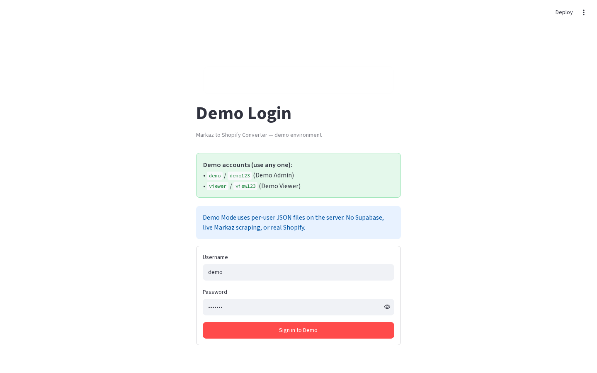

# Demo mode

**Version:** 0.1.0  
**Route:** `streamlit run demo_mode/app.py`  
**Who can access:** anyone (built-in demo accounts)




## What this page does

Runs a self-contained demo of the Markaz → Shopify workflow with **no Supabase**, **no live Markaz scrape**, and **no real Shopify API**. Storage is per-user JSON on the server.

## Layout at a glance

| Area | Content |
|------|---------|
| Banner | **Demo Mode** — simulated actions only |
| Login | **Demo Login** · **Sign in to Demo** |
| Nav | Tabs: **Shopify Converter** · **Tracked Products** |
| Converter | Single URL · Fetch / Add · Publish All (Demo) |
| Tracked | Seeded products · Sync / Publish / Refresh (Demo) |

## Steps

1. From the repo root:

   ```bash
   streamlit run demo_mode/app.py
   ```

2. Sign in with:

   | Username | Password | Label |
   |----------|----------|-------|
   | `demo` | `demo123` | Demo Admin |
   | `viewer` | `view123` | Demo Viewer |

3. Try Converter fetch/add and Tracked bulk/row actions.
4. Expect demo warnings on Shopify publish/sync.

## Demo vs production

| Feature | Demo | Production |
|---------|------|------------|
| Secrets | None | Required |
| Scrape | Simulated from URL | Playwright |
| Storage | `demo_mode/data/users/{username}/` | Supabase |
| Shopify | Simulated | Admin API |
| Add modes | Single URL only | Single / Multiple / Category |
| CSV download | Not in demo UI | Yes |
| Filters / pagination | No | Yes |
| Section control | Tabs | Horizontal radio |

First login seeds **3 dummy tracked products**. Handles are prefixed with `demo-`.

## Errors & edge cases

- “Admin” vs “Viewer” labels do not change permissions.
- Data is local to the machine/user folder — clearing that folder resets the demo store.

## Related links

- [Getting started](./00-getting-started.md)
- [Login](./01-login-page.md)
- [Tracked Products tab](./09-tracked-products-tab.md)
- [Configuration setup](./14-configuration-setup.md)
