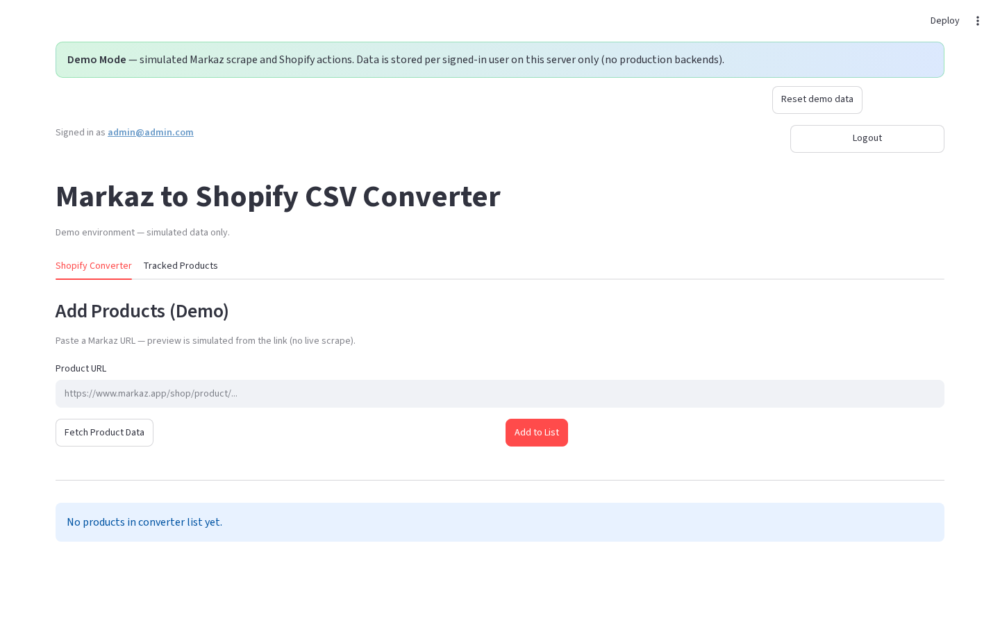
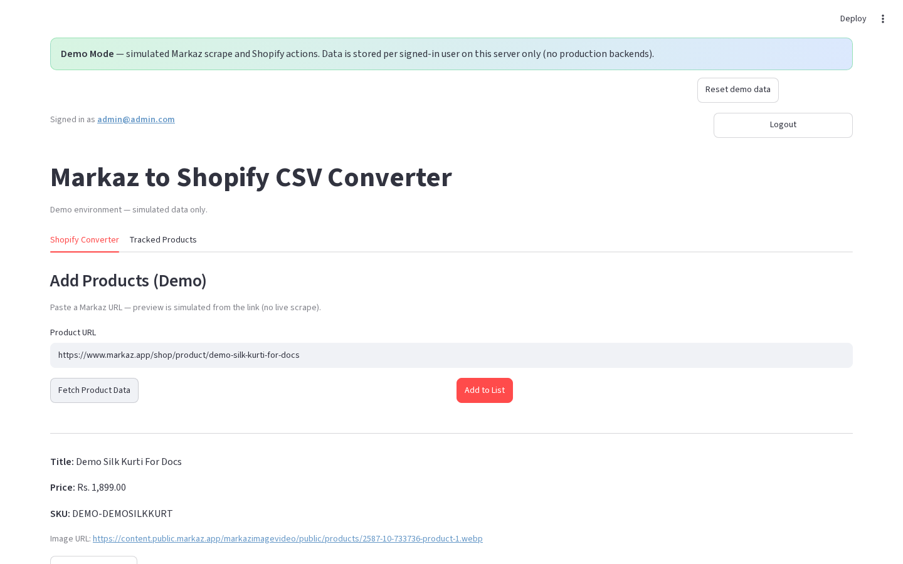
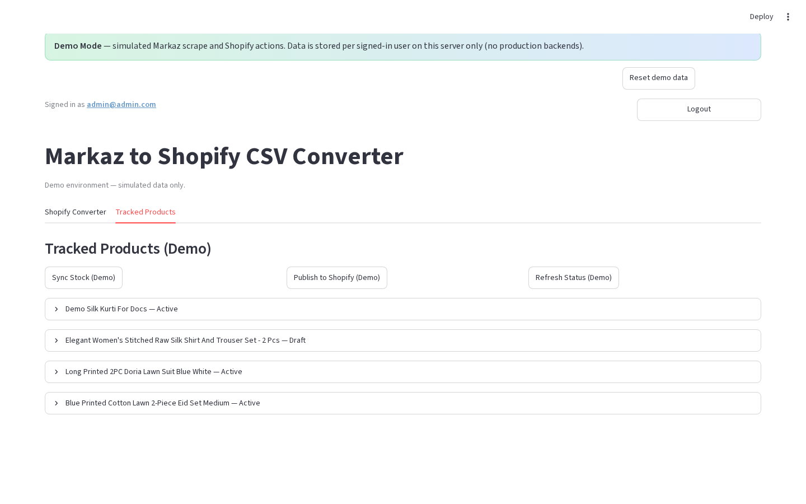
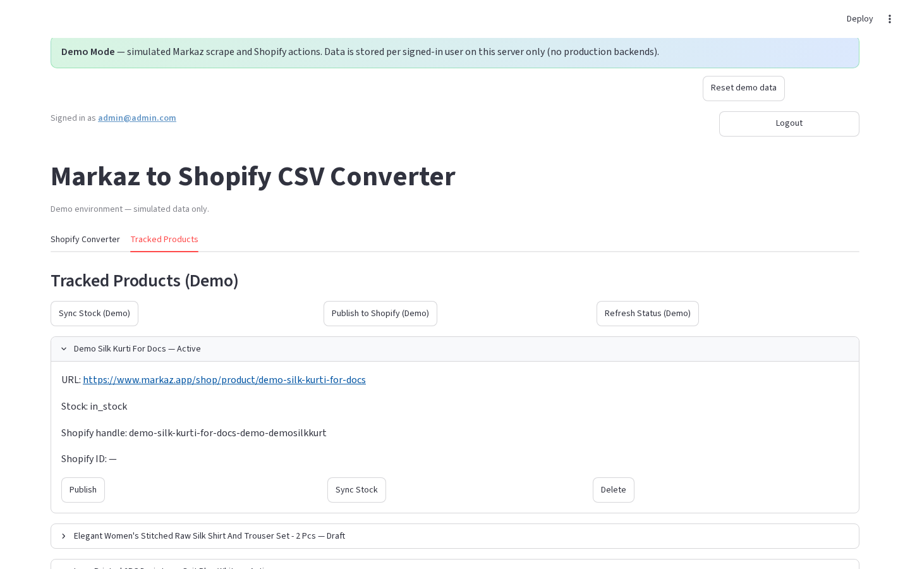

# Markaz to Shopify Converter

Scrape product data from [Markaz](https://www.markaz.app), apply pricing markups, export a Shopify-ready CSV, and publish or sync inventory to Shopify — with tracked URLs stored in Supabase. Store vendor name: **at One Spot**.


## Overview

Markaz to Shopify Converter is built for merchants and operations teams who source products on Markaz and sell on Shopify. It turns Markaz product pages into Shopify-ready catalog rows, keeps a tracked list of URLs, and can publish or refresh stock without re-entering data by hand.

Demo Mode lets stakeholders try the full workflow with simulated scrape and Shopify actions — no secrets, no Chromium, and no live store changes.

## Features

- Markaz product scraping (Playwright) — title, description, price, images, SKU, variants, breadcrumbs, stock
- Add modes — Single URL, Multiple URLs, or Category page + page range
- Shopify CSV export — required columns; Vendor = `at One Spot`
- Direct Shopify publish — create/update products, images, inventory, status
- Tracked Products (Supabase) — filters, pagination, bulk refresh / sync / publish / delete
- Pricing rules — editable delivery charges and margin for sale + compare-at
- Demo Mode — offline sandbox with professional seed data and per-user isolation

## Screenshots



*Shopify Converter — add products and build the list*



*Simulated product preview after Fetch Product Data (Demo Mode)*



*Tracked Products with seeded demo rows and Shopify status*



*Per-row Publish, Sync Stock, and Delete actions*


*Demo Mode login with clickable account cards*

## Demo

- **Local:** from the repo root, run `streamlit run demo-mode/app.py` (details in [`demo-mode/README.md`](demo-mode/README.md))
- **Live demo:** [https://demomode-for-makaz.streamlit.app/](https://demomode-for-makaz.streamlit.app/)
- **Logins:** shown as account cards on the Demo Mode login screen (Admin, Editor / Staff, Viewer)

Demo Mode must be deployed as its **own** Streamlit project (`demo-mode/app.py`). It is excluded from the main Vercel API deploy.

## Documentation

Full English guides and screenshots: [`Documentation/index.md`](Documentation/index.md)

| Topic | Guide |
|-------|--------|
| Getting started | [00](Documentation/00-getting-started.md) |
| Login | [01](Documentation/01-login-page.md) |
| Converter | [03](Documentation/03-shopify-converter-tab.md) |
| Tracked Products | [09](Documentation/09-tracked-products-tab.md) |
| Demo Mode | [15](Documentation/15-demo-mode.md) |
| Changelog | [CHANGELOG](Documentation/CHANGELOG.md) |

## Tech stack

| Layer | Choice |
|-------|--------|
| UI | Streamlit |
| Scrape | Playwright (Chromium) |
| Data | Supabase (production) / per-user JSON (demo) |
| Commerce | Shopify Admin API |
| Optional API | Vercel (`api/index.py`) |

## Getting started (production)

```bash
python3 -m venv venv
source venv/bin/activate
pip install -r requirements.txt
playwright install chromium
cp .streamlit/secrets.toml.example .streamlit/secrets.toml
# Edit [app_login], [supabase], [shopify]
streamlit run app.py
```

Never commit real secrets. See [Configuration setup](Documentation/14-configuration-setup.md).

## Pricing (defaults)

| Field | Formula |
|-------|---------|
| Sale price | `(Markaz + Delivery 215) × 1.25` |
| Compare-at | `Markaz × 2` |

Details: [Pricing rules](Documentation/13-pricing-rules.md)

## Version

**1.0.0** (2026-09-08) — see [`Documentation/APP-VERSION.md`](Documentation/APP-VERSION.md) and [`Documentation/CHANGELOG.md`](Documentation/CHANGELOG.md).

## License

Provided as-is for educational and commercial use.
